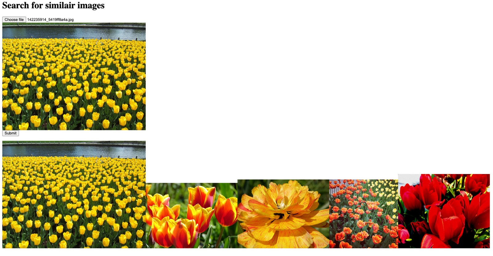
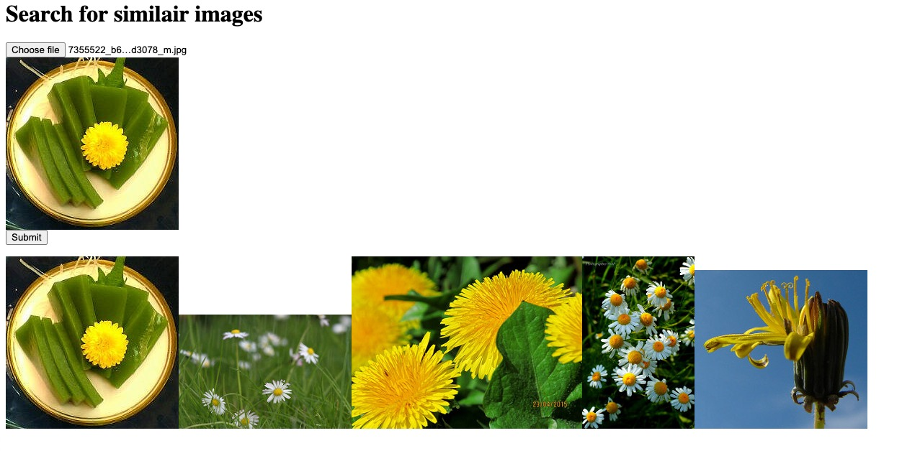

# Similari.py
* Use state-of-the-art machine learning to generate embeddings for arbitrary, labeled image datasets
* Integrates with [Milvus](https://milvus.io/) to perform vector-based similarity search
* Milvus environment is provided in docker-compose.yml

## Usage
* Run Milvus using `docker compose create`
* Create a new model and train it on your dataset by running `python generate.py` Two models will be created: `tf_predictor` and a `tf_featurator`.
    * `tf_predictor` is the initial model that is trained to categorize images in your dataset
    * `tf_featurator` is the resulting model that returns big embedding vectors to perform similarity search on
* Synchronize to Milvus by running `python sync.py`
* Finally, upload images and find similair images by running the webserver: `flask run`

## Examples

